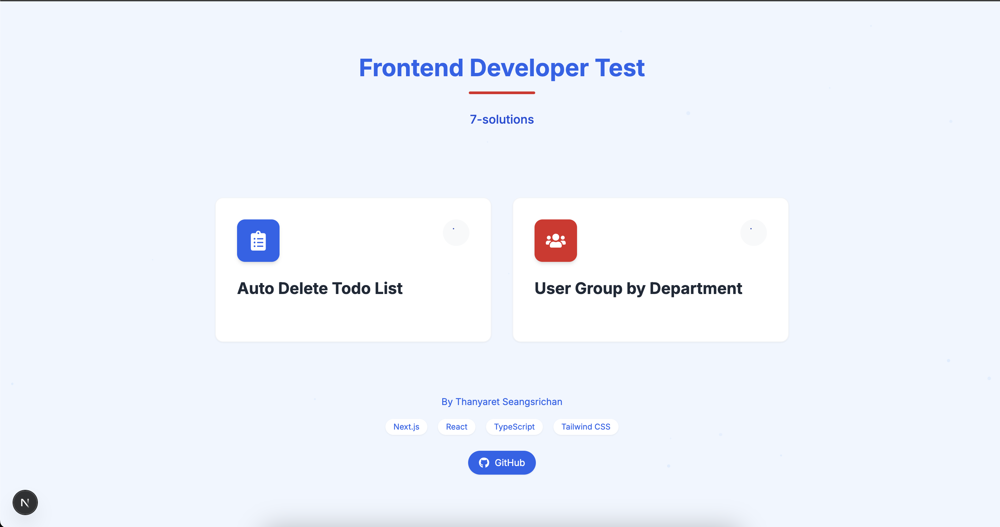
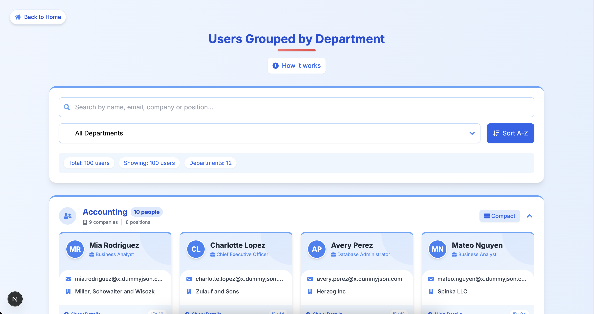
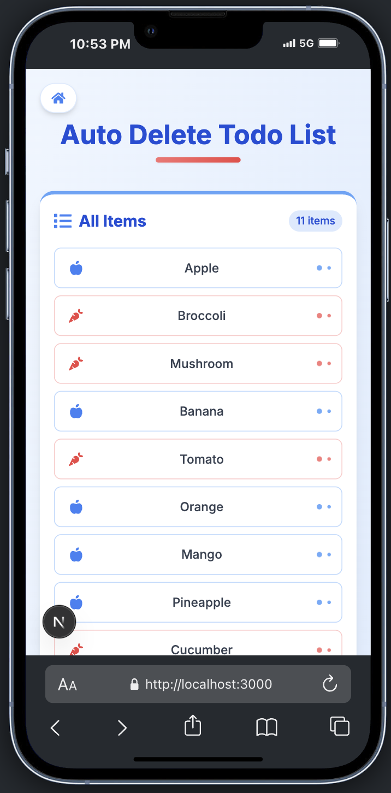
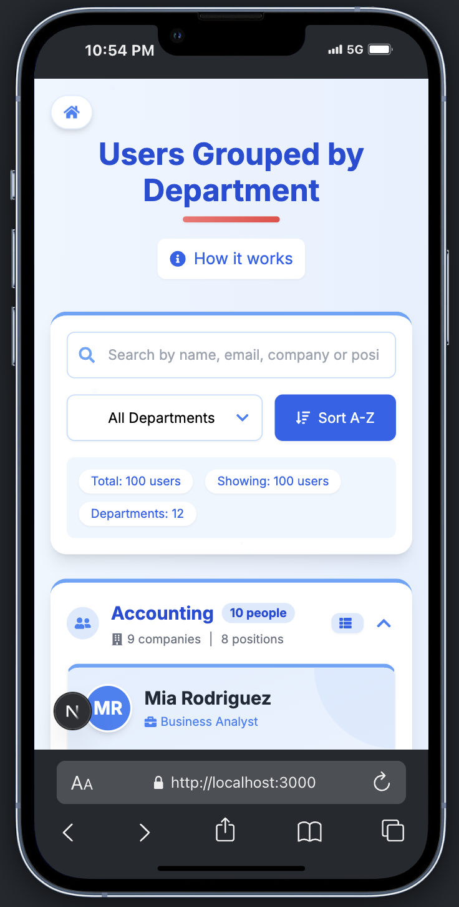

# 🚀 NextJS Todo & User Group Manager

[](https://github.com/thxnx36/Thanyaret-Frontend-test)


ระบบจัดการ Todo List แบบอัตโนมัติและระบบจัดกลุ่มผู้ใช้งานตามแผนก พัฒนาด้วย Next.js, React, TypeScript และ Tailwind CSS

## 📸 Screenshots

<div align="center">
  <a href="https://github.com/thxnx36/Thanyaret-Frontend-test">
    
  </a>
  <p align="center"><strong>หน้าแรกของเว็บไซต์</strong></p>
</div>

<table>
  <tr>
    <td>
      
      <p align="center">Todo Page</p>
    </td>
    <td>
      
      <p align="center">User Group Page</p>
    </td>
  </tr>
  <tr>
    <td>
      
      <p align="center">Todo Mobile View</p>
    </td>
    <td>
      
      <p align="center">User Group Mobile View</p>
    </td>
  </tr>
</table>

> **หมายเหตุ:** รูปภาพทั้งหมดอยู่ในโฟลเดอร์ `screenshots` สำหรับการแสดงผลใน GitHub

## ✨ คุณสมบัติเด่น

### 1. Todo List อัตโนมัติ
- รายการสินค้าที่สามารถย้ายระหว่างกลุ่มด้วยการคลิก
- การแสดงรายการแยกตามประเภท (Fruit และ Vegetable)
- ระบบย้ายรายการอัตโนมัติกลับหลังจาก 5 วินาที
- UI ที่สวยงามพร้อม Animation จาก Framer Motion
- การจัดเก็บข้อมูลใน Local Storage

### 2. ระบบจัดกลุ่มผู้ใช้งาน
- ดึงข้อมูลจาก API และจัดกลุ่มตามแผนก
- การค้นหาและกรองข้อมูลแบบ Real-time
- UI ที่ออกแบบอย่างพิถีพิถัน
- ระบบเปลี่ยนมุมมองระหว่าง Grid และ Table
- ประสบการณ์ผู้ใช้งานที่มีการโต้ตอบด้วย Animation

## 🛠️ เทคโนโลยีที่ใช้

- **Next.js 15**: Server-side rendering และ Static site generation
- **React 19**: การพัฒนา UI components
- **TypeScript**: Type safety สำหรับการพัฒนาที่ปลอดภัย
- **Tailwind CSS**: Utility-first CSS framework
- **Framer Motion**: Animation library สำหรับ React
- **Axios**: HTTP client สำหรับการดึงข้อมูลจาก API
- **React Icons**: Icon library สำหรับ React

## ⚙️ การติดตั้งและการใช้งาน

1. **Clone repository**

```bash
git clone git@github.com:thxnx36/Thanyaret-Frontend-test.git
cd Thanyaret-Frontend-test
```

2. **ติดตั้ง dependencies**

```bash
npm install
# หรือ
yarn install
```

3. **รันโปรเจกต์ในโหมด development**

```bash
npm run dev
# หรือ
yarn dev
```

4. **เปิดในเบราว์เซอร์**

เปิดเบราว์เซอร์และไปที่ [http://localhost:3000](http://localhost:3000)

## 📚 โครงสร้างโปรเจกต์

```
src/
├── api/                # API services และฟังก์ชันดึงข้อมูล
├── app/                # Next.js App Router
│   ├── page.tsx        # หน้าหลัก
│   ├── todo/           # หน้า Todo List
│   └── user-group/     # หน้า User Group
├── components/         # React Components
│   ├── todo/           # คอมโพเนนต์สำหรับ Todo List
│   └── userGroup/      # คอมโพเนนต์สำหรับ User Group
├── hooks/              # Custom React Hooks
├── types/              # TypeScript type definitions
└── utils/              # Utility functions
```

## 💡 วิธีการแคปรูปหน้าจอและเพิ่มลงใน README

1. **แคปหน้าจอ**
   - **Windows**: ใช้ `Win + Shift + S` หรือใช้ Snipping Tool
   - **macOS**: ใช้ `Cmd + Shift + 4` หรือใช้ Screenshot app
   - **Chrome DevTools**: ใช้ Device Mode เพื่อแคปในมุมมองมือถือ

2. **จัดการรูปภาพ**
   - สร้างโฟลเดอร์ `screenshots` ในโปรเจกต์
   - บันทึกรูปภาพในรูปแบบ PNG หรือ JPG
   - ปรับขนาดให้เหมาะสม (แนะนำความกว้างไม่เกิน 1200px)

3. **เพิ่มรูปภาพลงใน README**
   - ใช้ Markdown syntax: ``
   - หรือใช้ HTML เพื่อควบคุมขนาด: ``
   - หลังจาก push ขึ้น GitHub สามารถใช้ URL ของรูปภาพได้เลย

4. **การใช้ GitHub CDN**
   - หลังจาก push รูปภาพขึ้น GitHub ให้เปิดรูปภาพใน repository
   - คลิกขวาที่รูปภาพและเลือก "Copy image address"
   - ใช้ URL นี้แทน path ในการเพิ่มรูปภาพใน README

## 🚀 Performance Optimizations

- การใช้ `useMemo` และ `useCallback` เพื่อป้องกันการ re-render ที่ไม่จำเป็น
- การใช้ `React.lazy` และ dynamic imports เพื่อการ code splitting
- การใช้ Local Storage เพื่อเก็บข้อมูล Todo
- การใช้ Tailwind CSS เพื่อลดขนาด CSS
- การ Optimize animations ด้วย Framer Motion

## 📋 To-Do และการพัฒนาในอนาคต

- [ ] เพิ่มระบบ authentication
- [ ] เพิ่มการทดสอบด้วย Jest และ React Testing Library
- [ ] เพิ่มการ deploy ขึ้น Vercel หรือ Netlify
- [ ] เพิ่มฟีเจอร์ Dark mode
- [ ] ปรับปรุงประสิทธิภาพการทำงานกับข้อมูลจำนวนมาก

## 👨‍💻 ผู้พัฒนา

[Thanyaret Seangsrichan](https://github.com/thxnx36)

## 📄 License

[MIT License](LICENSE)
